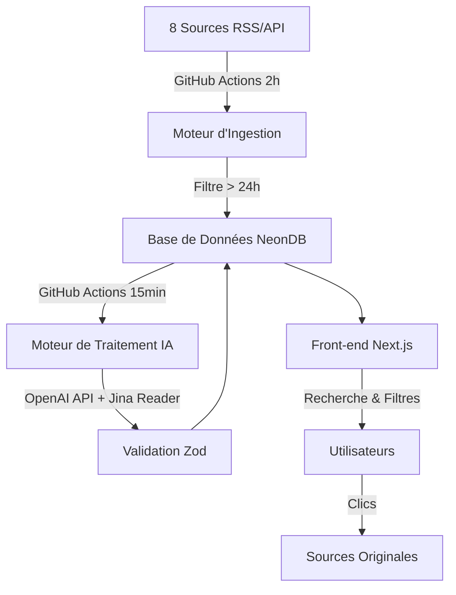
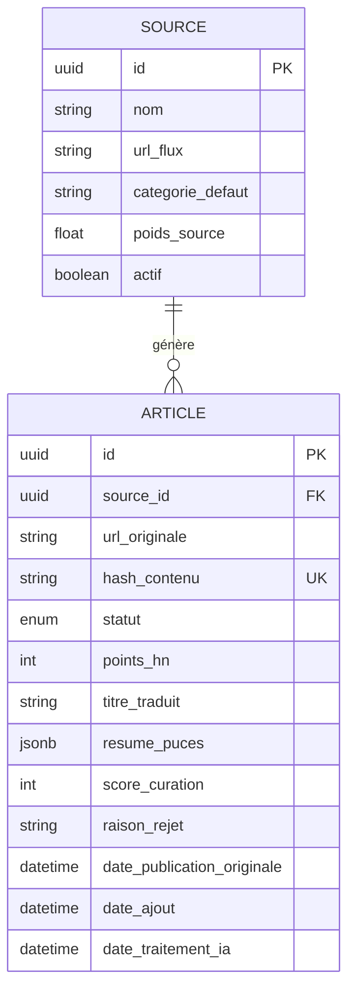

# Sema

**Plateforme automatisée d'agrégation d'actualités spécialisées dans l'Intelligence Artificielle**

---

## 📋 Table des matières

- [Vision et Objectifs](#-vision-et-objectifs)
- [Stack Technique](#-stack-technique)
- [Architecture](#-architecture)
- [Modèle de Données](#-modèle-de-données)
- [Logique Métier](#-logique-métier)
- [Intelligence Artificielle](#-intelligence-artificielle)
- [Algorithme de Classement](#-algorithme-de-classement)
- [Installation](#-installation)
- [Configuration](#-configuration)
- [Déploiement](#-déploiement)
- [Cadre Légal](#-cadre-légal)

---

## 🎯 Vision et Objectifs

Sema est une plateforme d'agrégation d'actualités qui utilise l'IA comme un "secrétaire de rédaction" pour filtrer, traduire et synthétiser l'information sur l'Intelligence Artificielle.

### La Promesse

Un flux francophone, factuel, débarrassé du bruit médiatique ("hype") et des fausses annonces. **Actuellement en production sur [sema-mocha.vercel.app](https://sema-mocha.vercel.app)**.

### La Méthode

L'IA lit, filtre, traduit et synthétise l'information sous un format strict de 3 puces, garantissant une consommation rapide et efficace de l'actualité.

### La Posture

Être un "bon citoyen du Web" en redirigeant le trafic vers les sources originales et en respectant les créateurs de contenu dans un cadre légal défendable.

### Fonctionnalités Principales

- 🔍 **Recherche en temps réel** dans les titres d'articles
- 🏷️ **Filtres par source** (OpenAI, Anthropic, DeepMind, etc.)
- 🎨 **Design moderne** avec badges colorés par catégorie
- 🧠 **Score IA** visible sur chaque article (1-10)
- ⚖️ **Pages légales** complètes (RGPD, mentions légales)
- 🔄 **Mise à jour automatique** toutes les 2h via GitHub Actions

---

## 🛠 Stack Technique

Architecture **Full-Stack Serverless** centralisée autour de l'écosystème TypeScript.

- **Framework** : Next.js (App Router)
- **Base de données** : NeonDB (PostgreSQL Serverless)
- **ORM** : Prisma ou Drizzle ORM
- **Intelligence Artificielle** : OpenAI API (`gpt-4o-mini`)
- **Validation** : Zod (Typage des retours IA)
- **Hébergement** : Vercel (Hosting + Cron Jobs)

---

## 🏗 Architecture

L'architecture repose sur deux moteurs asynchrones orchestrés par des **GitHub Actions** :

1. **Moteur d'Ingestion** (toutes les 2 heures) : Collecte et filtre les articles (ignore les articles > 24h)
2. **Moteur de Traitement IA** (toutes les 15 minutes) : Analyse et synthétise le contenu (batch de 6 articles)



---

## 📊 Modèle de Données

### Table `Source`

Stocke les configurations des fournisseurs d'informations.

| Champ              | Type    | Description                                                 |
| ------------------ | ------- | ----------------------------------------------------------- |
| `id`               | UUID    | Clé primaire                                                |
| `nom`              | String  | Ex: MIT Tech Review, Hacker News API                        |
| `url_flux`         | String  | Endpoint RSS ou API                                         |
| `categorie_defaut` | String  | Catégorie par défaut                                        |
| `poids_source`     | Float   | Multiplicateur de confiance (ex: 1.5 pour un site officiel) |
| `actif`            | Boolean | État de la source                                           |

### Table `Article`

Trace le cycle de vie complet de chaque actualité.

| Champ                        | Type     | Description                                                                                |
| ---------------------------- | -------- | ------------------------------------------------------------------------------------------ |
| `id`                         | UUID     | Clé primaire                                                                               |
| `source_id`                  | UUID     | Clé étrangère vers Source                                                                  |
| `url_originale`              | String   | URL de l'article source                                                                    |
| `hash_contenu`               | String   | Empreinte cryptographique (anti-doublon)                                                   |
| `statut`                     | Enum     | `en_attente`, `en_observation`, `rejete_ia`, `publie`, `erreur_api`, `ignore_score_faible` |
| `points_hn`                  | Int      | Score Hacker News (nullable)                                                               |
| `titre_traduit`              | String   | Titre en français (nullable)                                                               |
| `resume_puces`               | JSONB    | Tableau strict de 3 chaînes (nullable)                                                     |
| `score_curation`             | Int      | Note de 1 à 10 donnée par l'IA (nullable)                                                  |
| `raison_rejet`               | String   | Explication en cas de rejet (nullable)                                                     |
| `date_publication_originale` | DateTime | Date de parution chez la source                                                            |
| `date_ajout`                 | DateTime | Date d'ingestion                                                                           |
| `date_traitement_ia`         | DateTime | Date de fin du traitement OpenAI (nullable)                                                |



---

## ⚙️ Logique Métier

### Moteur 1 : L'Ingestion (GitHub Actions toutes les 2 heures)

1. **Parsing** : Lecture des flux RSS avec gestion d'erreurs isolée
2. **Filtre temporel** : Ignore automatiquement les articles > 24h (évite le bruit)
3. **Règles Hacker News (Machine à états)** :
   - **> 50 points** : Inséré en `en_attente`
   - **20-50 points** : Inséré en `en_observation`
   - **Mise à jour** : Articles `en_observation` qui dépassent 50 points → `en_attente`
   - **TTL** : Articles `en_observation` > 24h sans progression → `ignore_score_faible`
4. **Déduplication** : Hash SHA-256 pour éviter les doublons

### Moteur 2 : Le Traitement IA (GitHub Actions toutes les 15 minutes)

1. **Batching** : Récupère 6 articles en statut `en_attente` ou `erreur_api`
2. **Aspiration** : Récupération du contenu via Jina Reader
3. **Exécution** : Appel à l'API OpenAI avec Structured Outputs
4. **Validation** : Passage dans Zod
   - Succès → `publie`
   - Erreur → `erreur_api`

---

## 🤖 Intelligence Artificielle

### Structured Outputs OpenAI

Utilisation des **Structured Outputs** pour garantir un JSON stable validé par Zod :

```typescript
z.object({
  est_bloque_par_paywall: z.boolean(),
  est_de_la_hype_sans_substance: z.boolean(),
  score_importance: z.number().min(1).max(10),
  raison_rejet_detaillee: z.string(),
  titre_fr_factuel: z.string(),
  resume_3_puces: z.array(z.string().max(150)).length(3),
});
```

### Directives du Mega-Prompt

- **Filtre Hors-sujet** : Rejet des articles non liés à l'IA
- **Filtre Paywall** : Détection des contenus bloqués par inscription
- **Filtre Hype** : Rejet des contenus avec superlatifs sans données mesurables
- **Œuvre Transformatrice** : Synthèse en mots propres, jamais de citations longues
- **Focus** : Ce qui est annoncé, comment ça marche, quel est l'impact réel
- **Score de curation** : Note de 1 à 10 sur l'importance de l'info

---

## 📈 Algorithme de Classement

### Gravity Score

Pour éviter qu'un excellent article ne soit enterré sous une info moyenne récente, le tri utilise un algorithme de dégradation temporelle :

$$
Score = \frac{W_{source} \times Score_{curation}}{(T_{age} + 2)^G}
$$

Où :

- **W_source** : Poids de la source (défini en base)
- **Score_curation** : Évaluation IA (1 à 10)
- **T_age** : Âge de l'article en heures
- **G** : Constante de gravité (ex: 1.5)

---

## 🚀 Installation

### Prérequis

- Node.js 18+
- npm/yarn/pnpm
- Compte NeonDB
- Clé API OpenAI

### Installation locale

```bash
# Cloner le repository
git clone https://github.com/votre-username/sema.git
cd sema

# Installer les dépendances
npm install

# Configurer les variables d'environnement
cp .env.example .env.local

# Initialiser la base de données
npm run db:push

# Seed la base avec les sources premium
npx tsx db/seed.ts

# Lancer le serveur de développement
npm run dev
```

Ouvrir [http://localhost:3000](http://localhost:3000) dans votre navigateur.

---

## ⚙️ Configuration

### Variables d'environnement

```env
# Base de données NeonDB
DATABASE_URL="postgresql://..."

# OpenAI API
OPENAI_API_KEY="sk-..."

# Sécurité Cron (GitHub Actions)
CRON_SECRET="votre-secret-securise"

# Environnement
NODE_ENV="production"
```

### Configuration des sources

Les sources sont configurées via le script de seed `db/seed.ts`. **8 sources premium** sont pré-configurées :

1. **OpenAI News** (poids: 2.2) - Recherche & Modèles
2. **Anthropic News** (poids: 2.2) - Recherche & Modèles
3. **Google DeepMind** (poids: 2.0) - Recherche & Modèles
4. **Hugging Face** (poids: 1.8) - Open Source
5. **Google AI Blog** (poids: 2.0) - Recherche & Modèles
6. **MIT Tech Review AI** (poids: 1.3) - Business & Startups
7. **The Verge AI** (poids: 1.2) - Business & Startups
8. **Hacker News AI** (poids: 1.5) - Veille Communautaire

Pour ajouter une source :

```bash
# 1. Modifier db/seed.ts
# 2. Reset la base
npx tsx db/reset.ts
# 3. Re-seed
npx tsx db/seed.ts
```

---

## 🌐 Déploiement

### Déploiement sur Vercel

```bash
# Installer Vercel CLI
npm i -g vercel

# Déployer
vercel --prod

# Configurer les variables d'environnement sur Vercel
# DATABASE_URL, OPENAI_API_KEY, CRON_SECRET
```

### Configuration des GitHub Actions

Les Cron Jobs sont gérés par GitHub Actions (gratuit, sans limite) :

**`.github/workflows/cron-ingest.yml`** - Ingestion toutes les 2h

```yaml
name: 📡 Cron Ingest (Toutes les 2h)
on:
  schedule:
    - cron: '0 */2 * * *'
  workflow_dispatch:
jobs:
  run-ingest:
    runs-on: ubuntu-latest
    steps:
      - name: Appel de l'API d'ingestion
        run: |
          curl -X GET "https://sema-mocha.vercel.app/api/cron/ingest" \
          -H "Authorization: Bearer ${{ secrets.CRON_SECRET }}"
```

**`.github/workflows/cron-process.yml`** - Traitement IA toutes les 15min

```yaml
name: 🧠 Cron Process IA (Toutes les 15 min)
on:
  schedule:
    - cron: '*/15 * * * *'
  workflow_dispatch:
jobs:
  run-process:
    runs-on: ubuntu-latest
    steps:
      - name: Appel de l'API de traitement IA
        run: |
          curl -X GET "https://sema-mocha.vercel.app/api/cron/process" \
          -H "Authorization: Bearer ${{ secrets.CRON_SECRET }}"
```

**Configuration des secrets GitHub :**

1. Aller dans Settings > Secrets and variables > Actions
2. Ajouter `CRON_SECRET` avec la même valeur que sur Vercel

---

## ✨ Fonctionnalités Implémentées

### Frontend

- ✅ Recherche en temps réel dans les titres (paramètre URL `?q=`)
- ✅ Filtres par source (paramètre URL `?source=`)
- ✅ Design avec badges colorés par catégorie (Recherche, Open Source, Business, Veille)
- ✅ Icônes par catégorie (Brain, Code2, TrendingUp, Users, Newspaper)
- ✅ Score IA visible (1-10) sur chaque article
- ✅ Pagination "Voir plus" (10 articles par page)
- ✅ Formatage de date relatif ("Il y a 2h")
- ✅ Pages légales complètes

### Backend

- ✅ Filtre automatique des articles > 24h
- ✅ Batch de 6 articles pour le traitement IA
- ✅ 8 sources premium pré-configurées
- ✅ Scripts de seed et reset de la base
- ✅ GitHub Actions pour les crons (gratuit)

### Tests

- ✅ **62 tests unitaires et d'intégration** (100% de réussite)
- ✅ Framework Vitest + React Testing Library
- ✅ Couverture complète des fonctions critiques

---

## 🧪 Tests

### Suite de Tests Complète

Sema dispose d'une suite de **62 tests** couvrant toutes les fonctionnalités critiques :

```bash
# Lancer tous les tests
npm test

# Mode watch pour le développement
npm test -- --watch

# Interface UI interactive
npm run test:ui

# Rapport de couverture
npm run test:coverage
```

### Tests Implémentés

#### Tests Unitaires (46 tests)

**Gravity Score** (`__tests__/utils/gravityScore.test.ts`) - 7 tests

- Calcul du score avec dégradation temporelle
- Valorisation des sources premium
- Gestion des cas limites
- Tri correct des articles

**Hash SHA-256** (`__tests__/utils/hash.test.ts`) - 7 tests

- Génération de hash valide
- Déduplication (même contenu = même hash)
- Sensibilité à la casse
- Gestion des caractères spéciaux

**Validation Zod** (`__tests__/validation/zodSchema.test.ts`) - 10 tests

- Validation du schéma OpenAI
- Rejet des scores hors limites (1-10)
- Format 3 puces obligatoire
- Limite de 150 caractères par puce

**Filtre 24h** (`__tests__/api/dateFilter.test.ts`) - 9 tests

- Acceptation des articles récents
- Rejet des articles > 24h
- Gestion des cas limites

**Machine à États HN** (`__tests__/integration/hnStateMachine.test.ts`) - 13 tests

- Statut initial selon les points (50+, 20-49, < 20)
- Promotion de `en_observation` à `en_attente`
- TTL 24h pour articles en observation
- Workflows complets

#### Tests de Composants (16 tests)

**ArticleFeed** (`__tests__/components/ArticleFeed.test.tsx`) - 9 tests

- Affichage des articles et métadonnées
- Pagination (10 articles par page)
- Liens vers articles originaux
- Gestion des listes vides

**SourceFilters** (`__tests__/components/SourceFilters.test.tsx`) - 7 tests

- Affichage des badges de sources
- Interactions utilisateur
- Gestion des paramètres URL

### Résultats

```
Test Files  7 passed (7)
Tests       62 passed (62)
Duration    ~1s
```

✅ **100% de réussite** - Toutes les fonctions critiques sont testées et validées.

Pour plus de détails, consultez `__tests__/README.md`.

---

## ⚖️ Cadre Légal

### Interface Utilisateur et Protection Juridique

- **Transparence** : Badge "IA Score" visible sur chaque article
- **Attribution** : Nom de la source avec badge coloré par catégorie
- **Trafic Sortant** : Lien "Lire l'original" sur chaque article
- **Pages légales complètes** :
  - `/mentions-legales` - Éditeur, hébergement, propriété intellectuelle
  - `/confidentialite` - RGPD, cookies, liens externes
- **Notice & Takedown** : Email luca.ffz@icloud.com - Retrait sous 48h

### Bon Citoyen du Web

Sema respecte les créateurs originaux en :

- Redirigeant systématiquement vers les sources
- Créant une œuvre transformatrice (synthèse, non copie)
- Offrant un processus de retrait rapide et transparent

---

## 📝 Licence

MIT

---

## 🤝 Contribution

Les contributions sont les bienvenues ! Merci de :

1. Fork le projet
2. Créer une branche (`git checkout -b feature/amelioration`)
3. Commit vos changements (`git commit -m 'Ajout d'une fonctionnalité'`)
4. Push vers la branche (`git push origin feature/amelioration`)
5. Ouvrir une Pull Request

---

## 📧 Contact

Pour toute question ou demande de retrait : **luca.ffz@icloud.com**
