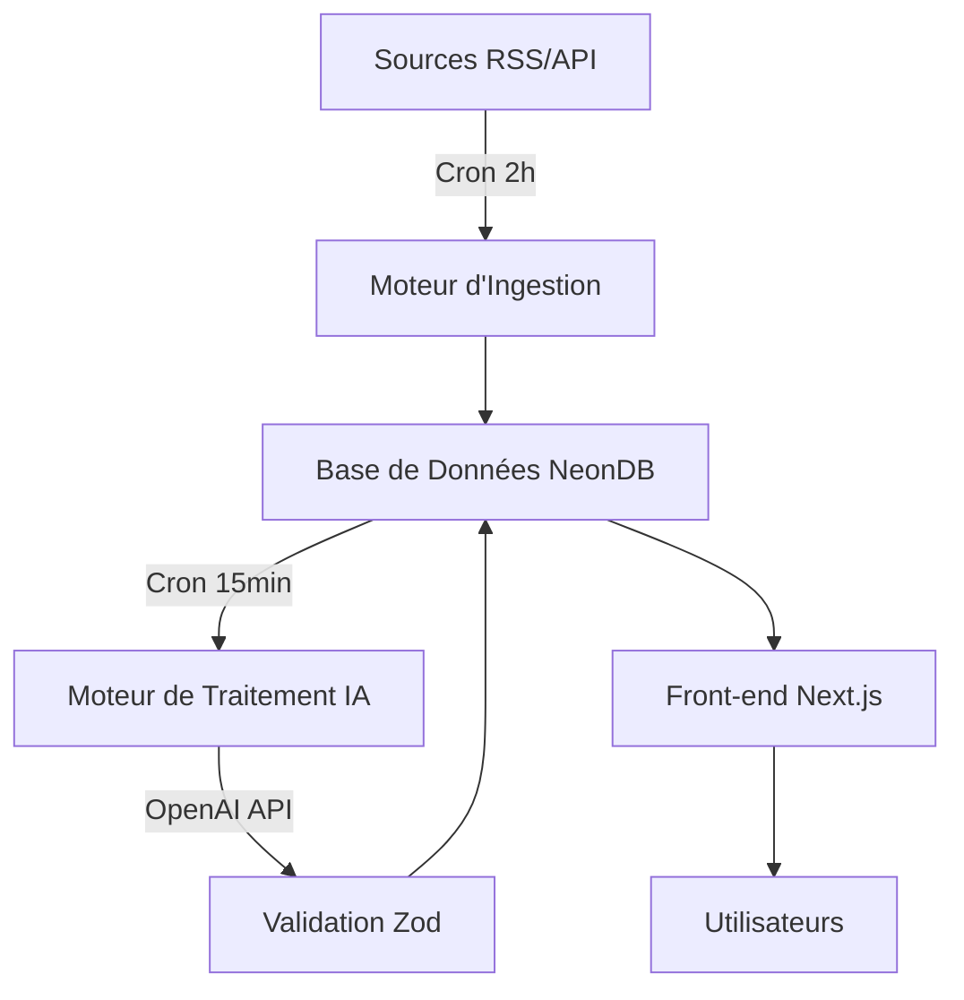
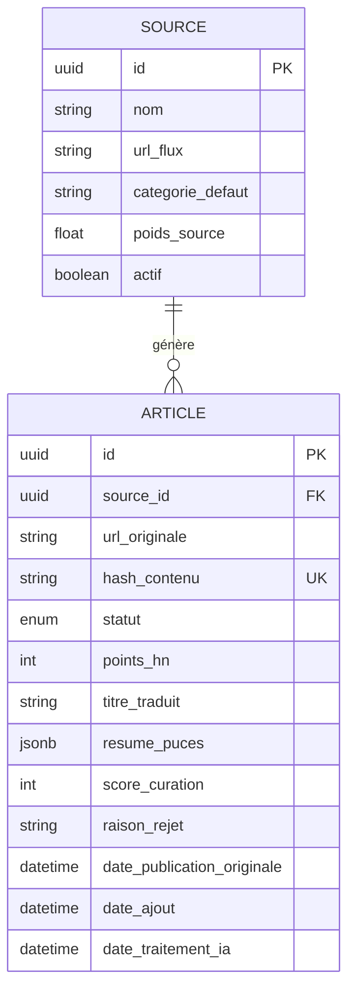

# Sema

**Plateforme automatisée d'agrégation d'actualités spécialisées dans l'Intelligence Artificielle**

---

## 📋 Table des matières

- [Vision et Objectifs](#-vision-et-objectifs)
- [Stack Technique](#-stack-technique)
- [Architecture](#-architecture)
- [Modèle de Données](#-modèle-de-données)
- [Logique Métier](#-logique-métier)
- [Intelligence Artificielle](#-intelligence-artificielle)
- [Algorithme de Classement](#-algorithme-de-classement)
- [Installation](#-installation)
- [Configuration](#-configuration)
- [Déploiement](#-déploiement)
- [Cadre Légal](#-cadre-légal)

---

## 🎯 Vision et Objectifs

Sema est une plateforme d'agrégation d'actualités qui utilise l'IA comme un "secrétaire de rédaction" pour filtrer, traduire et synthétiser l'information sur l'Intelligence Artificielle.

### La Promesse

Un flux francophone, factuel, débarrassé du bruit médiatique ("hype") et des fausses annonces.

### La Méthode

L'IA lit, filtre, traduit et synthétise l'information sous un format strict de 3 puces, garantissant une consommation rapide et efficace de l'actualité.

### La Posture

Être un "bon citoyen du Web" en redirigeant le trafic vers les sources originales et en respectant les créateurs de contenu dans un cadre légal défendable.

---

## 🛠 Stack Technique

Architecture **Full-Stack Serverless** centralisée autour de l'écosystème TypeScript.

- **Framework** : Next.js (App Router)
- **Base de données** : NeonDB (PostgreSQL Serverless)
- **ORM** : Prisma ou Drizzle ORM
- **Intelligence Artificielle** : OpenAI API (`gpt-4o-mini`)
- **Validation** : Zod (Typage des retours IA)
- **Hébergement** : Vercel (Hosting + Cron Jobs)

---

## 🏗 Architecture

L'architecture repose sur deux moteurs asynchrones orchestrés par des Vercel Cron Jobs :

1. **Moteur d'Ingestion** (toutes les 2 heures) : Collecte et filtre les articles
2. **Moteur de Traitement IA** (toutes les 15 minutes) : Analyse et synthétise le contenu



---

## 📊 Modèle de Données

### Table `Source`

Stocke les configurations des fournisseurs d'informations.

| Champ              | Type    | Description                                                 |
| ------------------ | ------- | ----------------------------------------------------------- |
| `id`               | UUID    | Clé primaire                                                |
| `nom`              | String  | Ex: MIT Tech Review, Hacker News API                        |
| `url_flux`         | String  | Endpoint RSS ou API                                         |
| `categorie_defaut` | String  | Catégorie par défaut                                        |
| `poids_source`     | Float   | Multiplicateur de confiance (ex: 1.5 pour un site officiel) |
| `actif`            | Boolean | État de la source                                           |

### Table `Article`

Trace le cycle de vie complet de chaque actualité.

| Champ                        | Type     | Description                                                                                |
| ---------------------------- | -------- | ------------------------------------------------------------------------------------------ |
| `id`                         | UUID     | Clé primaire                                                                               |
| `source_id`                  | UUID     | Clé étrangère vers Source                                                                  |
| `url_originale`              | String   | URL de l'article source                                                                    |
| `hash_contenu`               | String   | Empreinte cryptographique (anti-doublon)                                                   |
| `statut`                     | Enum     | `en_attente`, `en_observation`, `rejete_ia`, `publie`, `erreur_api`, `ignore_score_faible` |
| `points_hn`                  | Int      | Score Hacker News (nullable)                                                               |
| `titre_traduit`              | String   | Titre en français (nullable)                                                               |
| `resume_puces`               | JSONB    | Tableau strict de 3 chaînes (nullable)                                                     |
| `score_curation`             | Int      | Note de 1 à 10 donnée par l'IA (nullable)                                                  |
| `raison_rejet`               | String   | Explication en cas de rejet (nullable)                                                     |
| `date_publication_originale` | DateTime | Date de parution chez la source                                                            |
| `date_ajout`                 | DateTime | Date d'ingestion                                                                           |
| `date_traitement_ia`         | DateTime | Date de fin du traitement OpenAI (nullable)                                                |



---

## ⚙️ Logique Métier

### Moteur 1 : L'Ingestion (Cron toutes les 2 heures)

1. **Parsing** : Lecture des flux RSS avec gestion d'erreurs isolée
2. **Règles Hacker News (Machine à états)** :
   - **> 50 points** : Inséré en `en_attente`
   - **20-50 points** : Inséré en `en_observation`
   - **Mise à jour** : Articles `en_observation` qui dépassent 50 points → `en_attente`
   - **TTL** : Articles `en_observation` > 24h sans progression → `ignore_score_faible`

### Moteur 2 : Le Traitement IA (Cron toutes les 15 minutes)

1. **Batching** : Récupère 3 à 5 articles en statut `en_attente` ou `erreur_api`
2. **Exécution** : Appel à l'API OpenAI
3. **Validation** : Passage dans Zod
   - Succès → `publie`
   - Erreur → `erreur_api`

---

## 🤖 Intelligence Artificielle

### Structured Outputs OpenAI

Utilisation des **Structured Outputs** pour garantir un JSON stable validé par Zod :

```typescript
z.object({
  est_bloque_par_paywall: z.boolean(),
  est_de_la_hype_sans_substance: z.boolean(),
  score_importance: z.number().min(1).max(10),
  raison_rejet_detaillee: z.string(),
  titre_fr_factuel: z.string(),
  resume_3_puces: z.array(z.string().max(150)).length(3),
});
```

### Directives du Mega-Prompt

- **Filtre Paywall** : Détection des contenus bloqués par inscription
- **Filtre Hype** : Rejet des contenus avec superlatifs sans données mesurables
- **Œuvre Transformatrice** : Synthèse en mots propres, jamais de citations longues
- **Focus** : Ce qui est annoncé, comment ça marche, quel est l'impact réel

---

## 📈 Algorithme de Classement

### Gravity Score

Pour éviter qu'un excellent article ne soit enterré sous une info moyenne récente, le tri utilise un algorithme de dégradation temporelle :

$$
Score = \frac{W_{source} \times Score_{curation}}{(T_{age} + 2)^G}
$$

Où :

- **W_source** : Poids de la source (défini en base)
- **Score_curation** : Évaluation IA (1 à 10)
- **T_age** : Âge de l'article en heures
- **G** : Constante de gravité (ex: 1.5)

---

## 🚀 Installation

### Prérequis

- Node.js 18+
- npm/yarn/pnpm
- Compte NeonDB
- Clé API OpenAI

### Installation locale

```bash
# Cloner le repository
git clone https://github.com/votre-username/sema.git
cd sema

# Installer les dépendances
npm install

# Configurer les variables d'environnement
cp .env.example .env.local

# Initialiser la base de données
npx prisma migrate dev

# Lancer le serveur de développement
npm run dev
```

Ouvrir [http://localhost:3000](http://localhost:3000) dans votre navigateur.

---

## ⚙️ Configuration

### Variables d'environnement

```env
# Base de données
DATABASE_URL="postgresql://..."

# OpenAI
OPENAI_API_KEY="sk-..."

# Vercel Cron (en production)
CRON_SECRET="votre-secret"
```

### Configuration des sources

Les sources sont configurées directement dans la base de données via la table `Source`.

---

## 🌐 Déploiement

### Déploiement sur Vercel

```bash
# Installer Vercel CLI
npm i -g vercel

# Déployer
vercel

# Configurer les Cron Jobs dans vercel.json
```

### Configuration des Cron Jobs

```json
{
  "crons": [
    {
      "path": "/api/cron/ingestion",
      "schedule": "0 */2 * * *"
    },
    {
      "path": "/api/cron/traitement-ia",
      "schedule": "*/15 * * * *"
    }
  ]
}
```

---

## ⚖️ Cadre Légal

### Interface Utilisateur et Protection Juridique

- **Transparence** : Mention "Synthèse générée par IA" sur chaque élément
- **Attribution** : Nom de la source clairement affiché
- **Trafic Sortant** : Bouton "Lire l'article original" pointant vers la source
- **Notice & Takedown** : Page légale avec email de contact pour demandes de retrait sous 24h

### Bon Citoyen du Web

Sema respecte les créateurs originaux en :

- Redirigeant systématiquement vers les sources
- Créant une œuvre transformatrice (synthèse, non copie)
- Offrant un processus de retrait rapide et transparent

---

## 📝 Licence

MIT

---

## 🤝 Contribution

Les contributions sont les bienvenues ! Merci de :

1. Fork le projet
2. Créer une branche (`git checkout -b feature/amelioration`)
3. Commit vos changements (`git commit -m 'Ajout d'une fonctionnalité'`)
4. Push vers la branche (`git push origin feature/amelioration`)
5. Ouvrir une Pull Request

---

## 📧 Contact

Pour toute question ou demande de retrait : contact@sema.fr
